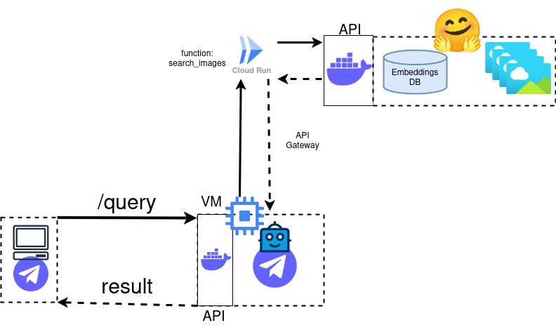

# Google Cloud Platform Application: implementation of a Telegram Bot that performs an image search in a HuggingFace Space

A global depiction of the application architecture here implemented can be seen in the Figure below:

</img>

The following README.md file addresses how to use the code of this repository to run the application described in the architecture above.

## Requirements

Before following the instructions of this README to implement the application, you must have the following requirements installed:

- Python Virtual Environments.
- The Google Cloud Platform Client for CLI that you can install following <a href="https://cloud.google.com/sdk/docs/install">this guide</a>.

> SUGGESTION: if you wish, you have a Dockerfile in the root directory of this repo. This image includes the GCloud CLI client and the Python Virtual Environments installed. You will be able to connect with it via SSH.

## First step: Creating a Telegram Bot

I will not explain how to do it here, because I have already done it in <a href="https://github.com/Dani-97/clip_imagesearch_aws_telegram_bot">this repo</a> and there are many tutorials available online of how to do it. All I can say is "store the TOKEN of the bot you have created, because you will need it later".

## Second step: Creating and deploying the Google Cloud Run Function to connect with HuggingFace

Once you have all the requirements installed, clone this repository and login to your Google Cloud Platform account if you have not done it yet. This can be easily done by typing the command <code>gcloud auth login</code> or executing the script <code>gcloud_login.sh</code> included in this repository. 

After that, you will need to do the following to set up a project:

- You will need to choose a few configuration variables. In this repository, you have a file called <code>necessary_variables_template.sh</code>. Copy this file to another one called <code>necessary_variables.sh</code> with <code>cp necessary_variables_template.sh necessary_variables.sh</code>.

- Edit this file choosing your project name (be aware that it must be unique, so I would recommend to add a random set of numbers at the end) and billing account id (to find yours, you can follow <a href="https://cloud.google.com/billing/docs/how-to/find-billing-account-id">this guide</a>).

With these variables set up, let's go to the creation and selection of the project. To do so, run <code>create_project.sh</code> (if it is already created, you can skip this step). Once created, load it running <code>load_project.sh</code>. GCloud works in a way that, once selected the project, you will not need to refer to it again unless you have logged out and need to log in again. This means that, all the commands that you run after choosing the project, will refer to that project.

Now, go to the directory <code>function_scripts</code>. There, you will also need to set up the variables of the <code>necessary_variables.sh</code> file, copying the template <code>necessary_variables_template.sh</code>. In this case, you will need to choose the <code>REPO_PROJECT_ROOT_DIR</code> that, in this case, will be <code>./clip_image_search_client</code> and the <code>REGION</code> in which you want to run the function.

Once done this, you have two options: running the function locally or deploying it to the Google Cloud Platform.

- **Running the function locally:** if you want to run the function locally to test it before uploading it to the cloud environment, you can execute the script <code>debug_image_search_client.sh</code>. This script will change to the repository directory, create a Virtual Environment, install some requirements and run the function with the tool <code>functions-framework</code>. This tool will be automatically installed within the requirements. If everything has been set up ok, you should be make calls to this running function locally.

- **Deploying the function to the Google Cloud Platform:** this step is even simpler. You just need to run <code>deploy_function.sh</code> and the function will be uploaded to the cloud using the <code>gcloud run</code> command.

After the deployment, the first part of the architecture will be addressed.

## Third step: Creating the Virtual Machine and running a Docker container to manage the Telegram Bot

The next step is to create and run a Virtual Machine. Like in previous occasions, the first thing you will need to do is setting the environment variables. To do so, copy the file <code>necessary_variables_template.sh</code> to <code>necessary_variables.sh</code> and set the name of the Virtual Machine, the Hostname, the Region and the Zone.

After this, run <code>create_vm_ssh_connection.sh</code>, that will create a SSH key pair and connect to the Virtual Machine for the first time. Then, exit the Virtual Machine. After exiting, the script will copy the contents of the <code>./.ssh</code> directory to the current one.

From then on, the way to connect to the Virtual Machine will be via SSH using the script <code>connect_with_vm_ssh.sh</code>. This script will not only connect to the Virtual Machine, but will also copy the other scripts that will be necessary to run the Docker container in that remote Virtual Machine.

Once in, the first thing you need to do is run <code>install_packages.sh</code>, that will install Docker. This will be followed by <code>import_telebot_project.sh</code>, that will download the files from the repository <code>clip_imagesearch_aws_telegram_bot</code> that you can find <a href="https://github.com/Dani-97/clip_imagesearch_aws_telegram_bot">here</a>.

After the project has been imported, you need to set up the connection with the bot. Go to Projects/clip_imagesearch_aws_telegram_bot/telegram_bot. Now, edit the file <code>config.cfg</code> changing token (filling this field with the corresponding token of the bot that you have initially created) and the api_endpoint (that corresponds with the API Endpoint you obtained in the second step and that allows to retrieve the output of the Google Cloud Run Function). When the <code>config.cfg</code> is set up, go to the <code>vm_scripts</code> root directory, where you will have two options:

- **Create a Docker container for debugging with <code>debug_telebot_docker_cont.sh</code>**

- **Create a Docker container to deploy the telebot manager with <code>run_telebot_docker_cont.sh</code>**

The only actual difference between the options is that the debugging alternative will run in the foreground, while the deployment option will be run in the background, allowing to exit the command line without killing the container.

Once you have both the Cloud Run Function and the VM Docker Container running, go to your Telegram bot, type <code>/start</code> and it should give you the instructions of how to use it. At any point, you can ask the same thing with <code>/help</code>. To make a search, just type <code>/query \<QUERY\></code> and, after a few seconds, you should receive a list of images that correspond with what you were searching for.